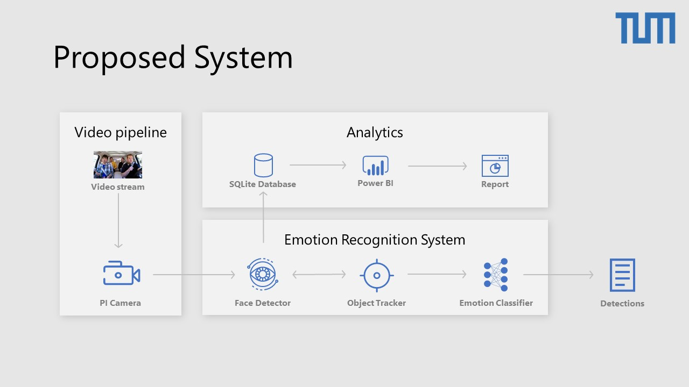

# Implementation Documentation



## Requirements
OpenCV 3.4.4+, dlib 19.4+,  Tensorflow 1.14+, joblib 0.13.2+, imutils 0.5.2+, numpy 1.16+, python 3.6.7+, scikit learn 0.21.2+, scipy 1.2.1+, sqlite 3.28.0+

## Documentation
### Implementation
#### Overview
* archive folder: This folder contains older implementatins that were replaced
* benchmark folder: This folder contains the video used for benchmarking (the benchmark output is not saved to git and can be downloaded [here](https://1drv.ms/u/s!Ar3Og3BLl4rdiO8bzVCyCJgRcAm2qQ?e=BRT6JL)
* models folder: This folder contains the final model used for face detection (frozen_inference_graph) as well as the final classifier model (svm_classifier_custom_50_13.joblib). In addition to that the model used in the cascade implementation (pretrained folder) and the OpenCV CNN (Resnet folder) are also included.
* util folder: This folder contains helper files as well as the facial landmark detector. In addition to that the analytics framework including the 'Measurements' SQLite database is also in this folder
* Analytics.pbix: This is the Power BI file that reads the data from the SQLite database, transforms it and stores all data based visualizations.
* cnn_caffe.py: This is the OpenCV CNN implementation for the face detector.
* cnn_tensorflow.py: This is the implementation for the face detector based on our CNN.
* cv2_cascade.py: This is the OpenCV Viola Jones implementation for the face detector.
* dlib_HoG.py: This is the dlib HoG implementation for the face detector.
* **emotion_detector.py**: This is the final implementation combining our own trained CNN, the KCF motion tracker, the dlib facial landmark detector and the SVM emotion classifier.
* motion_tracker.py: This file contains the KCF and MOSSE implementation used for the object tracker benchmark.

The code for the emotion detector is fully commented, the helpers and benchmarking implementations are commented where needed.
To switch from the camera videostream to a prerecorded video use the file video stream (the implementation is added as a comment in every file). To save the output to a video file uncomment all lines starting with ("out...")
#### How to run the final emotion detector on the raspberry pi
1. Install Dependencies
	* Install all required libraries, including tensorflow, opencv and dlib (which can take a few days of compiling) OR
	* Download my [preconfigured PI Image](https://1drv.ms/f/s!Ar3Og3BLl4rdib1qOpeUWYE1uf47Nw) with all dependencies preinstalled and pull the latest code from git (The file needs to be unziped first)
2. Run the following script:
```bash
source ~/.profile
workon py3cv4
cd ~/thesis/Implementation
python emotion_detector.py
```
#### How to run the final emotion detector on windows
1. Open the Pycharm project in .idea and let pycharm install all dependencies
2. Run the emotion_detector configuration
### Analytics Framework
Analytics is performed with Power Bi ([get Power BI here](https://docs.microsoft.com/de-de/power-bi/desktop-get-the-desktop)) and is based on the measurements stored in the 'util/Measurements' SQLite database.
**Power BI is only available for Windows, please use [power bi web](https://app.powerbi.com/view?r=eyJrIjoiMTE1NDFjNzEtZTQxNS00ZjRmLTkwMjUtZGQyOTg5MTRmOTRiIiwidCI6IjVkN2I0OWU5LTUwZDItNDBkYy1iYWIxLTE0YTJkOTAzNTQyYyIsImMiOjh9) to see the results on other platforms. The report has multiple pages, Page 2 is about the final system, page 3 contains the qualitative benchmark and page 4 the performance benchmark.**
All benchmarking videos can be found [here](https://1drv.ms/u/s!Ar3Og3BLl4rdiO8bzVCyCJgRcAm2qQ?e=ZwIQh5)

### Raspberry PI setup script
**Most** dependencies can be installed using this bash script. **This script will not install everything as some manual steps are also required!** It is highly recommended to use the provided sdcard image as some libraries need to be build from source which will take days...
```bash
#https://www.pyimagesearch.com/2018/09/26/install-opencv-4-on-your-raspberry-pi/
#STEP 2
sudo apt-get install build-essential cmake unzip pkg-config
sudo apt-get install libjpeg-dev libpng-dev libtiff-dev
sudo apt-get install libavcodec-dev libavformat-dev libswscale-dev libv4l-dev
sudo apt-get install libxvidcore-dev libx264-dev
sudo apt-get install libgtk-3-dev
sudo apt-get install libcanberra-gtk*
sudo apt-get install libatlas-base-dev gfortran
sudo apt-get install python3-dev

#STEP 3
cd ~
wget -O opencv.zip https://github.com/opencv/opencv/archive/4.0.0.zip
wget -O opencv_contrib.zip https://github.com/opencv/opencv_contrib/archive/4.0.0.zip
unzip opencv.zip
unzip opencv_contrib.zip
mv opencv-4.0.0 opencv
mv opencv_contrib-4.0.0 opencv_contrib

#STEP 4
wget https://bootstrap.pypa.io/get-pip.py
sudo python3 get-pip.py
#Install Virtual Environment
sudo pip install virtualenv virtualenvwrapper
sudo rm -rf ~/get-pip.py ~/.cache/pip
echo -e "\n# virtualenv and virtualenvwrapper" >> ~/.profile
echo "export WORKON_HOME=$HOME/.virtualenvs" >> ~/.profile
echo "export VIRTUALENVWRAPPER_PYTHON=/usr/bin/python3" >> ~/.profile
echo "source /usr/local/bin/virtualenvwrapper.sh" >> ~/.profile
source ~/.profile
#Create Virtual Environment
mkvirtualenv py3cv4 -p python3
#Switch to virtual environment
workon py3cv4
pip install numpy

#STEP 5
cd ~/opencv
mkdir build
cd build
cmake -D CMAKE_BUILD_TYPE=RELEASE \
    -D CMAKE_INSTALL_PREFIX=/usr/local \
    -D OPENCV_EXTRA_MODULES_PATH=~/opencv_contrib/modules \
    -D ENABLE_NEON=ON \
    -D ENABLE_VFPV3=ON \
    -D BUILD_TESTS=OFF \
    -D OPENCV_ENABLE_NONFREE=ON \
    -D INSTALL_PYTHON_EXAMPLES=OFF \
    -D BUILD_EXAMPLES=OFF ..

#Increase SWAP Size to 2048 (Read Instructions)
sudo nano /etc/dphys-swapfile
sudo /etc/init.d/dphys-swapfile stop
sudo /etc/init.d/dphys-swapfile start

#Compile and Install OpenCV
make -j4
sudo make install
sudo ldconfig

#Decrease SWAP Size to 100

#STEP 6 Link to Virtual Environment
cd ~/.virtualenvs/py3cv4/lib/python3.5/site-packages/
ln -s /usr/local/python/cv2/python-3.5/cv2.cpython-35m-arm-linux-gnueabihf.so cv2.so
cd ~


#dlib and others


sudo apt-get install libhdf5-dev libhdf5-serial-dev libhdf5-100
sudo apt-get install libqtgui4 libqtwebkit4 libqt4-test python3-pyqt5
sudo apt-get install libatlas-base-dev
sudo apt-get install libjasper-dev
pip3 install opencv-contrib-python

# https://www.pyimagesearch.com/2017/05/01/install-dlib-raspberry-pi/
# https://www.pyimagesearch.com/2018/01/22/install-dlib-easy-complete-guide/


sudo apt-get update
sudo apt-get install build-essential cmake
sudo apt-get install libopenblas-dev liblapack-dev libatlas-base-dev
sudo apt-get install libx11-dev libgtk-3-dev


pip3 install numpy
pip3 install dlib
pip3 install numpy
pip3 install scipy
pip3 install matplotlib
pip3 install graphviz
pip3 install --upgrade cython
pip3 install Cython -vv
pip3 install scikit-learn
pip3 install "picamera[array]"
pip3 install --user --upgrade tensorflow # install in $HOME
```
All links containing shares will automatically expire on Oct 1st 2019 or as soon as the thesis is graded, whichever comes first.
